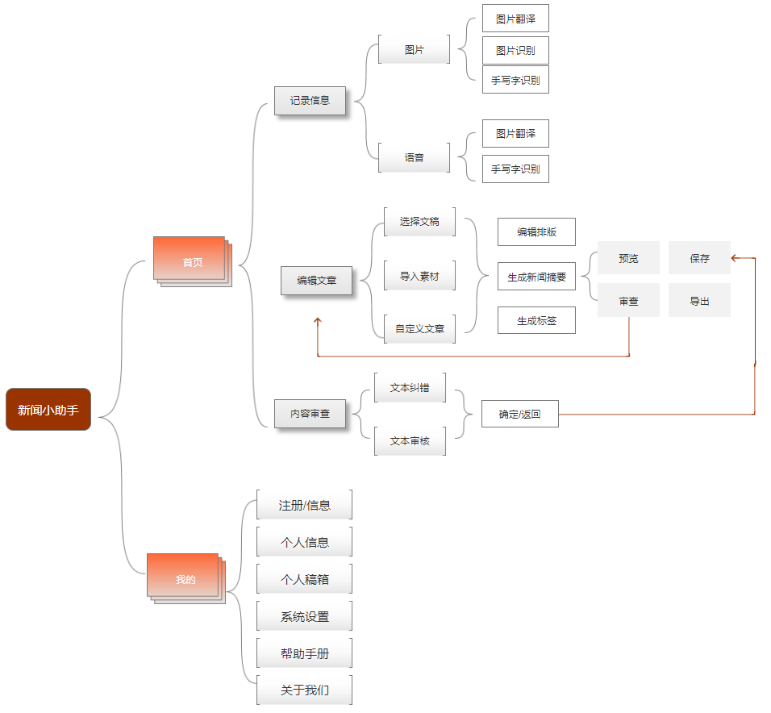
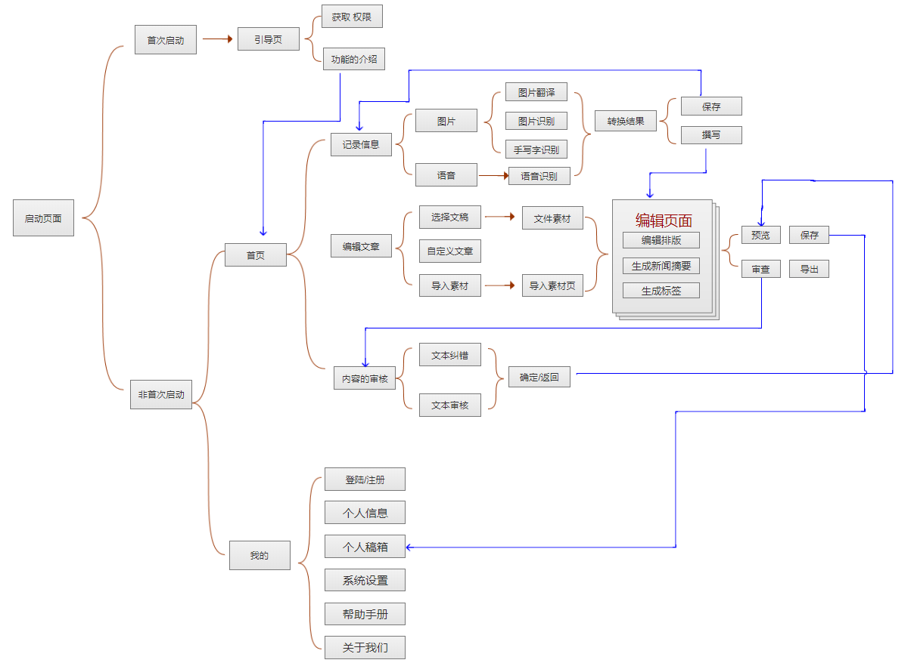
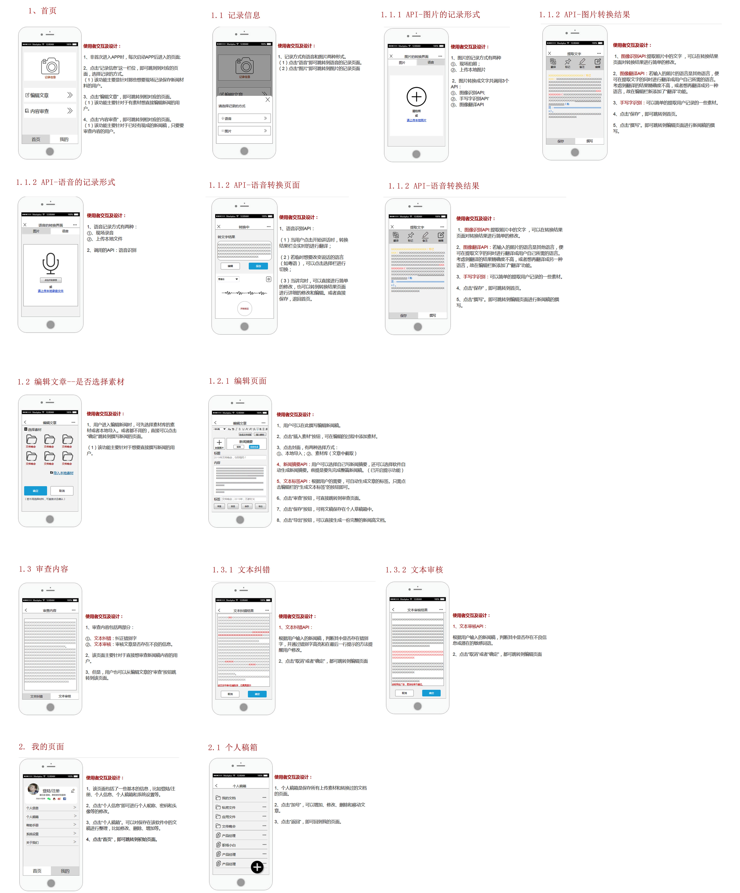

# 新闻小助手

|发布日期|2019年12月4日|
| ---------- | --- |
|产品名称|新闻小助手|
|文件现状|已经基本完成|
|文件的主人|郑晓萍|
|领头的设计师|郑晓萍|
|领头的开发者|郑晓萍|
|迭代版本|2.0|
# 目录
|产品的PRD设计|原型设计|机器学习之API的输出入展示
|---------- | --- |---------- 
|[PRD1-加值宣言](#chapter1) |[产品功能架构](#chapter1)|---------- 
|[PRE2-核心价值](#chapter2) |[流程图](#chapter1)|---------- 
|[PRD3-用户痛点宣言](#chapter3) |[全局说明](#chapter1)|----------
|[产品简介](#chapter4) |[原型1.交互及界面设计](#chapter1) |---------- 
|[产品背景](#chapter5) |[原型2.信息设计](#chapter1)|----------
|[产品目标](#chapter6) |[原型3.原型文档](#chapter1)|---------- 
|[用户画像](#chapter7) |[原型4.口头操作说明](#chapter1) |---------- 
|[用户需求](#chapter8) |[Axure交互及设计低保真原型](#chapter1) |---------- 
|[情景假设](#chapter9) | --- |---------- 
|[问题与解决](#chapter10) | --- |---------- 
|[考虑后不完成之项](#chapter11) | --- |---------- 
|[PRD4-人工智能概率性与用户痛点](#chapter12)| --- |---------- 
|[PRD5-需求列表与人工智能API加值](#chapter13)| --- |---------- 

<h3 id="chapter1">一、加值宣言 </h3>
- 阿里的实时语音识别api的价值:
> 将用语音记录的信息转化成文字，省去了重复听取录音摘取其中有价值信息的时间，提高了效率。

- 手写字识别api的价值：
> 可以将我们在采访流程的手写记录的信息直接转成文字。

- 图像识别api的价值：
> 可将采访中所用的图片资料（采访对象的PPT、发言稿等）直接转换成文字，省去了将图片文字手打一遍的过程，节省时间。

- 新闻摘要api的价值：
> 在极短的时间内生成一篇新闻的摘要，而且概括性强，可以解决摘要概括性不强、摘要质量不好等问题。

- 文本纠错api价值：
> 可以有效的解决新闻稿审核时间长而且审核后仍然出现错误的情况。减少审核的人力和时间成本，且大大提升了文章的质量。

- 文本审核api的价值：
> - 对浏览者的评论信息检测，一旦发现有恶意垃圾评论，可以做到文本的自动审核与实时过滤。
> - 作者提交的文章中如若夹杂了推广、反动、色情信息，会给内容平台带来极大的法律风险，应用文本审核可帮助解决平台一直以来困扰和担心的问题。

- 文本标签api价值：
> 对文章进行核心关键词分析，为新闻个性化推荐、相似文章聚合、文本内容分析等提供技术支持

-  倾向分析api价值：
> 通过对需要舆情监控的实时文字数据流进行情感倾向性分析，帮助他们更好的回复相关的评论。
<h3 id="chapter2">二、核心价值 </h3>

- 最小可行性产品（产品的核心价值）
> 提供语音输入、图像识别和翻译、手写字识别等功能，可供新闻编辑者快速记录并提取信息进行新闻的撰写。
> 帮助他们自动生成新闻的摘要和文本标签。并对进行文本审核和纠错。

<h3 id="chapter3">三、用户痛点宣言</h3>

|序号|痛点|
|------|---|
|1|新闻编辑者经常面临采访资料和采访笔记超级多，他们经常要现在word文档中把所有的资料整理在一起再开始撰写。但是在整理资料的过程中，需要耗费的时间非常多，常常需要到不同的软件把纸质版的资料扫描识别成电子版，或者需要手动再把资料写一遍。|
|2| 一些新闻编辑者对于写文章的摘要是一件困难的事情，常常面临着不会写、写的质量不好等尴尬局面。|
|3|高校新媒体的发布平台一般是以公众号为主，以学校官网为辅，但是这些平台的修改次数是有限的，这大大限制了他们审核的能力。|
|4|而且一些编辑者常常会借助平台之便，发表一些不当的言论，会给该公众号甚至是学校带来负面的影响|

<h3 id="chapter4">四、产品简介 </h3>  

- 该产品提供语音输入、图像识别和翻译、手写字识别和文字识别等多种记录采访内容和采访资料的方式。
- 该产品可以帮编辑者完成的新闻稿迅速提取摘要和生成文本标签，并对文章进行文本纠错和文本审核，节省审核时间和提高效率。
- 该产品还能通过情感分析自动分析和回复浏览者的信息及相关的评论。

<h3 id="chapter5">五、产品背景 </h3>

- 自媒体逐渐成为高校内一种主要的媒体平台,且基本都由学生团队运营。
- 但是由于繁重的学业和知识的限制，这些学生并没有多余的时间学习到更加专业知识，甚至常常为了写稿而加班加点，为写新闻摘要而冥思苦想。
- 从记录到撰稿，从编辑到排版，从审核到发布，新媒体提供了个人发表资讯的途径，简化的传统媒体发布新闻的流程，却依旧保留了媒体制作的时间成本。
- 在[大融合背景下高校学生自媒体的立身之策——以“佛系学习社”为例 ](https://kns.cnki.net/KCMS/detail/detail.aspx?dbcode=CJFQ&dbname=CJFDLAST2019&filename=SHIT201909142&uid=WEEvREcwSlJHSldRa1FhdXNXaEhoOHRvcktTUUZCYk1wTjB5aHpCVU13Yz0=$9A4hF_YAuvQ5obgVAqNKPCYcEjKensW4IQMovwHtwkF4VYPoHbKxJw!!&v=MDM2NzVCWm9SOGVYMUx1eFlTN0RoMVQzcVRyV00xRnJDVVJMT2VadVJtRnkvbFZMdkxOaVhDZXJHNEg5ak1wbzU=)论文中，根据调查结果表示，高校的学生新闻编辑者想要在自媒体林立的市场中寻找到立身之地,就应该注重文章质量,将效果呈现作为检验标准,抓住受众,找到属于自己的特色标签。

> 参考文献：[大融合背景下高校学生自媒体的立身之策——以“佛系学习社”为例 ](https://kns.cnki.net/KCMS/detail/detail.aspx?dbcode=CJFQ&dbname=CJFDLAST2019&filename=SHIT201909142&uid=WEEvREcwSlJHSldRa1FhdXNXaEhoOHRvcktTUUZCYk1wTjB5aHpCVU13Yz0=$9A4hF_YAuvQ5obgVAqNKPCYcEjKensW4IQMovwHtwkF4VYPoHbKxJw!!&v=MDM2NzVCWm9SOGVYMUx1eFlTN0RoMVQzcVRyV00xRnJDVVJMT2VadVJtRnkvbFZMdkxOaVhDZXJHNEg5ak1wbzU=)

<h3 id="chapter6">六、产品的目标</h3>

- 帮助新闻辩编者者以最快速和高校的方式整理采访中记录的问题或收集到的资料，帮助他们快速撰写文章，节省时间。
- 帮助新闻编辑者更好的撰写新闻摘要，升华文章；根据用户的需要看是否需要自动生成标签。
- 同时也能帮他们对文本进行纠错和审核，减少审核时间和提高文章质量。
- 通过情感分析帮助他们合理的回复和处理相关评论。

<h3 id="chapter7">七、用户画像</h3>

类别 | 详情
---|---
群体 | 高校大学生媒体工作者
年龄 | 18-25岁
工作 | 1.记录 --> 撰写 2.编辑 --> 排版 3.审核 --> 发布 4.获得评论 --> 得到反馈  
痛点 | ==1==.记录：图片、手写或语音记录整理成文字工作机械枯燥，耗时较长 ==2.== 撰写：撰写新闻稿时间长，常常熬夜写稿 ==3.== 审核：审核时间长，需要耗费人工，常常人工审稿 ==4.== 评论：评论太多无法人工 进行舆论分析后仍出现错误
用户画像|

<h3 id="chapter8">八、用户需求</h3>

- 高校媒体工作者需要一个软件，能帮助他们快速记录和整理资料，最快的节省时间，提高效率。
- 高校的媒体工作者需要写完一篇文章后就能快速的生成高质量、概括性较好的摘要。并且根据需要添加文本标签。
- 高校的媒体工作者需要有自动帮他们的文章进行纠正和审核，提高文章的质量的同时也能减少审核的时间成本。

<h3 id="chapter9">九、情景假设</h3>

|新媒体工作者|身份|面临的问题|
| ---------- | --- |----------- |
|小刘|某媒体部的小干事|经常熬夜整理新闻稿的资料，将所有的资料整理成电子版。但是一些资料比如语音需要反复听才能抓取到其中对新闻有用的价值。
|小李|某媒体部的小干事|需要接受小刘的工作，要把小刘整理成一篇完整且具有逻辑的新闻稿，经常需要再三询问小刘整理资料中的一些问题。而且小李对新闻的摘要非常苦恼，经常需要苦苦思考但是质量却不好。还经常需要部门的其他干事一起帮忙想。
|小郑|某媒体部的副部长|需要对小干事所写的文章进行一遍审核，要十分的用心和细心看文章是否存在错别字或是语法的错误。经常需要反复修改小干事所撰写的新闻摘要。
|小黄|某媒体部的部长|对副部长审核的文章还要再审核一遍，检查是否还存在错误，并且和副部长一起探讨新闻摘要是否得当。
|小廖|某媒体部的指导老师|是该部门的指导老师，最后把关文章的全部内容，而且他们要适当的保留修改的内容，才能确保万一还存在错误有机会再修改。

<h3 id="chapter10">十、问题与解决</h3>

|问题|解决|
| ---------- | --- |
|手动整理大量的资料（如图片中的文字）、语音等，把这些资料整理成电子文字版|提供语音输入、图像识别和翻译、手写字识别等功能，可供新闻编辑者快速记录并提取信息进行撰写。|
|经常要为写好新闻摘要而冥思苦想，甚至还要请人帮忙|为他们完成的新闻稿自动的生成摘要|
|经常要两三个人甚至更多审核文章中的问题|提供文本纠错和文本审核的功能，自动快速的审查文章|

<h3 id="chapter11">十一、考虑后不做之项</H3>

- 为文本添加标签。因高校的新闻编辑者投放新闻的渠道是公众号和官网的平台，所以对于文本标签的需求量不是很大。
- 通过情感分析自动分析和回复浏览者的信息及相关的评论。

<h3 id="chapter12">十二、人工智能概率性与用户痛点</h3>

- 目前人类对ImageNet图像的识别错误率大约在5%，微软的人工智能系统的错误率为4.94%，谷歌为4.8%。百度在2015年的时候已将这一错误率进一步降至4.58%，实现了质的飞跃。[百度超级计算机图像识别超人类水平 错误率低于微软谷歌](http://tech.ifeng.com/a/20150512/41080218_0.shtml)

> 错误现象的解决方法：

- 当图像/语音识别出现偏差时，提供简单编辑修改的功能。可以手动修改无法识别或者识别出现错误的地方。
- 当自动生成的新闻摘要概括性不强，质量不好时，可以提醒用户再次尝试自动生成，或者让用户对不满意之处进行修改。

<h3 id="chapter13">十三、需求列表与人工智能API加值</h3>

###### 需求列表

- 高校媒体工作者需要一个软件，能帮助他们快速记录和整理资料，最快的节省时间，提高效率。
- 高校的媒体工作者需要写完一篇文章后就能快速的生成高质量、概括性较好的摘要。并且根据需要添加文本标签。
- 高校的媒体工作者需要有自动帮他们的文章进行纠正和审核，提高文章的质量的同时也能减少审核的时间成本。

###### 人工智能API加值
- 新闻摘要api的价值：
> 在极短的时间内生成一篇新闻的摘要，而且概括性强，可以解决摘要概括性不强、摘要质量不好等问题。

- 文本纠错api价值：
> 可以有效的解决新闻稿审核时间长而且审核后仍然出现错误的情况。减少审核的人力和时间成本，且大大提升了文章的质量。

- 文本审核api的价值：
> - 对浏览者的评论信息检测，一旦发现有恶意垃圾评论，可以做到文本的自动审核与实时过滤。
> - 作者提交的文章中如若夹杂了推广、反动、色情信息，会给内容平台带来极大的法律风险，应用文本审核可帮助解决平台一直以来困扰和担心的问题。

- 文本标签api价值：
> 对文章进行核心关键词分析，为新闻个性化推荐、相似文章聚合、文本内容分析等提供技术支持

- 手写字识别api的价值：
> 可以将我们在采访流程的手写记录的信息直接转成文字。

# 第二部分：原型设计

<h3 id="chapter2">一、产品架构图</h3>

<h3 id="chapter2">二、产品流程图</h3>

<h3 id="chapter2">三、原型的全局说明</h3>

###### 功能权限分为登录/未登录两个状态：
- 登陆状态：能及时的查看个人稿箱，并且能进行备份保存和导出等操作。
- 未登陆状态：只能进行简单的操作，如记录信息。但是不能进行编辑等。
###### 底部栏：
- 首页：首页的功能包括记录信息、撰写文章和文本审核。
- 我的：我的页面可以登陆/注册，和查看个人稿箱等。

<h3 id="chapter2">四、Axure原型文档交互展示</h3>

####  [Axure原型文档交互展示](http://nfunm104.gitee.io/api_final_exam)

# 第三部分：机器学习之API的输出入展示

<h3 id="chapter2">一、API输入与输出</h3>

###### 新闻摘要api：
- 在极短的时间内生成概括性强的新闻摘要。
[详细的代码示例](https://github.com/zhengxiaopingzxp/API_ML_PM_Final_Project/blob/master/code/%E6%96%B0%E9%97%BB%E6%91%98%E8%A6%81.ipynb)

###### 文本纠错api：
- 对文本内容进行和纠错。
[详细的代码示例](https://github.com/zhengxiaopingzxp/API_ML_PM_Final_Project/blob/master/code/%E6%96%87%E6%9C%AC%E7%BA%A0%E9%94%99%E5%92%8C%E6%96%87%E6%9C%AC%E5%AE%A1%E6%A0%B8.ipynb)

###### 文本审核api：
- 对文本内容进行和纠错。
[详细的代码示例](https://github.com/zhengxiaopingzxp/API_ML_PM_Final_Project/blob/master/code/%E6%96%87%E6%9C%AC%E7%BA%A0%E9%94%99%E5%92%8C%E6%96%87%E6%9C%AC%E5%AE%A1%E6%A0%B8.ipynb)

###### 文本标签api：
- 对文章进行核心关键词分析，生成标签。
[详细的代码示例](https://github.com/zhengxiaopingzxp/API_ML_PM_Final_Project/blob/master/code/%E6%96%87%E6%9C%AC%E6%A0%87%E7%AD%BE.ipynb)

###### 手写字识别api：
- 将在采访流程的手写记录的信息直接转成文字。

- [百度手写字api详细代码示例](https://github.com/zhengxiaopingzxp/API_ML_PM_Final_Project/blob/master/code/%E7%99%BE%E5%BA%A6%E6%89%8B%E5%86%99%E5%AD%97api.ipynb)

- [讯飞手写字api详细代码](https://github.com/zhengxiaopingzxp/API_ML_PM_Final_Project/blob/master/code/%E8%AE%AF%E9%A3%9E%E6%89%8B%E5%86%99%E5%AD%97api.ipynb)

<h3 id="chapter2">二、API1.使用水平</h3>
- 输入：语音或者本地音频；输出：文字
- 输入：图片；输出：文字
- 输入：完整新闻稿；输出：新闻摘要
- 输入：完整新闻稿；输出：文本标签
- 输入：完整新闻稿；输出：高亮的文本错误
- 输入：完整新闻稿；输出：高亮的内容错误

- [所有代码示例](https://github.com/zhengxiaopingzxp/API_ML_PM_Final_Project/tree/master/code)

<h3 id="chapter2">三、API2.使用比较分析</h3>

### 手写字识别比较
通过搜索引擎发现排名较为靠前的百度ai开放平台和讯飞开放平台提供手写字识别服务并对此进行比较
|对比项|百度|讯飞|
|---|---|---|
|代码比较|||
|使用效果|对于字迹潦草的字体根本无法输出文字，仅使用与字体工整的手写字|对于字迹潦草的字体，仍然能给出部分输出文字，相比百度而已文字的识别准确度也比较高，可查看代码对比|
|成熟度|[2019-12-09刚刚推出最新版的api文档](https://ai.baidu.com/ai-doc/OCR/hk3h7y2qq)，调用方法和过程比较繁琐，没有给定参考代码，服务刚刚推出，处于起步阶段|[有详细的api调用文档及说明](https://www.xfyun.cn/doc/words/wordRecg/API.html#%E6%8E%A5%E5%8F%A3%E8%AF%B4%E6%98%8E)，并且有相应开发语言的调用示例代码，服务较为成熟|
|定价|[百度ai开放平台手写字api产品价格](https://ai.baidu.com/ai-doc/OCR/9k3h7xuv6)|[讯飞开放平台手写字api](https://www.xfyun.cn/services/wordRecg)|
|服务评估|仅有api文档且无示例代码，应用场景和参数不完整，无法进行进一步开发调用|[具有详细的说明](https://www.xfyun.cn/services/wordRecg)及[api调用教程](https://www.xfyun.cn/doc/words/wordRecg/API.html#%E6%8E%A5%E5%8F%A3%E8%AF%B4%E6%98%8E),且参数划分完整，提供业务参数，可扩展性强|
总结：通过对比调取百度ai开放平台和讯飞开放平台提供的手写字识别api，对比输出结果，综合上述内容，最终选定使用讯飞开发平台提供的api服务。

<h3 id="chapter2">四、API3.使用后风险报告</h3>

- 自行进行代码测试比较，百度api和讯飞api利用同一图片进行比较，讯飞api识别率更高，但仍存在一些误差，可能会对用户体验造成影响，但本app可进行自定义编辑，可对错误识别的文字进行更正，且增设了文本纠错功能。

对比项 | 百度 | 讯飞 | 总结
---|---|---|---
API市场竞争程度 | bing搜索排行为第一 | bing搜索排行第三 | 讯飞搜索引擎排名较前，且是api说明介绍页面，说明经常更新，服务推出较早，比较成熟。百度仅显示文档调用页面，说明并不是核心业务，推出时间较短。
输入输出限制 | 仅支持中文字体及数字 | 支持中英文自动识别 | 对于手写字体的全面性上，讯飞的服务更为完善
定价 | [百度ai开放平台手写字api产品价格](https://ai.baidu.com/ai-doc/OCR/9k3h7xuv6)|[讯飞开放平台手写字api](https://www.xfyun.cn/services/wordRecg)| 从免费额度来看，百度提供每日50次免费调用量，讯飞提供90天10w次调用的免费调用量。但是百度可进行按套餐付费与按量付费两种方式，讯飞仅支持套餐。
短期来讲可使用讯飞的免费额度，后续等百度服务质量与api接入服务更为完善再考虑转换

<h3 id="chapter2">五、API4.加分项平</h3>
- 用到的的api有新闻摘要api、文本审核api、文本纠错api、文本标签api、手写字识别api、图像识别api.

- [新闻摘要代码示例](https://github.com/zhengxiaopingzxp/API_ML_PM_Final_Project/blob/master/code/%E6%96%B0%E9%97%BB%E6%91%98%E8%A6%81.ipynb)

- [文本纠错的代码示例](https://github.com/zhengxiaopingzxp/API_ML_PM_Final_Project/blob/master/code/%E6%96%87%E6%9C%AC%E7%BA%A0%E9%94%99%E5%92%8C%E6%96%87%E6%9C%AC%E5%AE%A1%E6%A0%B8.ipynb)

- [文本审核的代码示例](https://github.com/zhengxiaopingzxp/API_ML_PM_Final_Project/blob/master/code/%E6%96%87%E6%9C%AC%E7%BA%A0%E9%94%99%E5%92%8C%E6%96%87%E6%9C%AC%E5%AE%A1%E6%A0%B8.ipynb)

- [文本标签的代码示例](https://github.com/zhengxiaopingzxp/API_ML_PM_Final_Project/blob/master/code/%E6%96%87%E6%9C%AC%E6%A0%87%E7%AD%BE.ipynb)

- [百度手写字api详细代码示例](https://github.com/zhengxiaopingzxp/API_ML_PM_Final_Project/blob/master/code/%E7%99%BE%E5%BA%A6%E6%89%8B%E5%86%99%E5%AD%97api.ipynb)

- [讯飞手写字api详细代码](https://github.com/zhengxiaopingzxp/API_ML_PM_Final_Project/blob/master/code/%E8%AE%AF%E9%A3%9E%E6%89%8B%E5%86%99%E5%AD%97api.ipynb)
